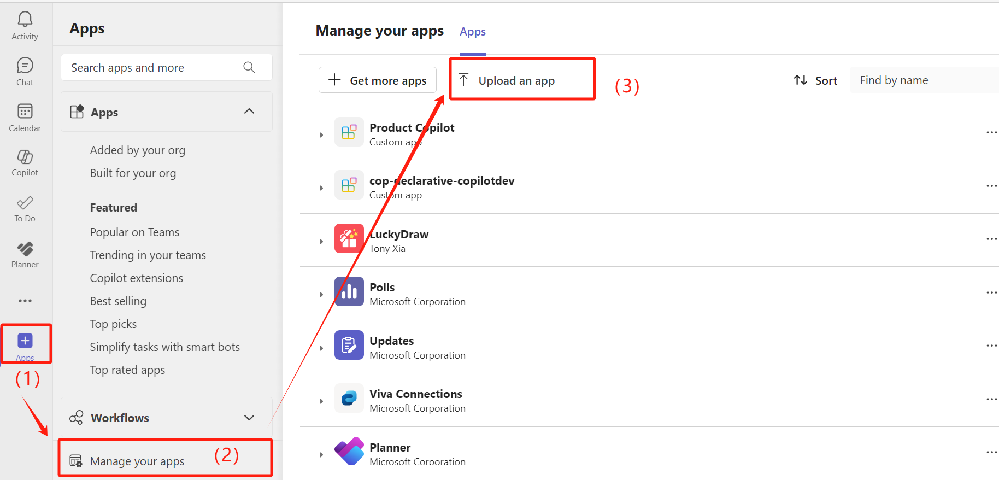
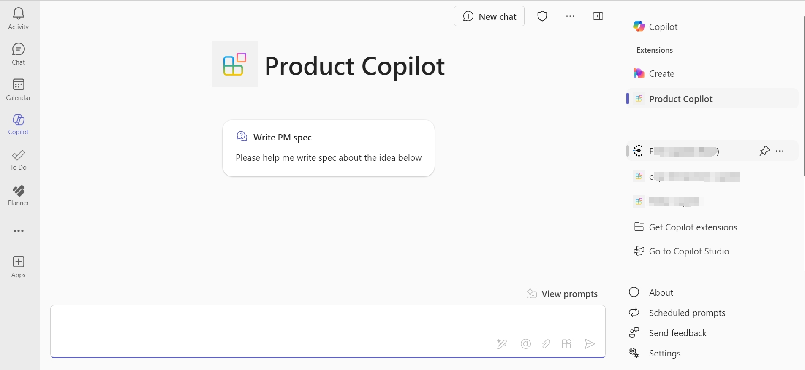

The unofficial PowerShell module for Microsoft Copilot, currently it provides the following features:

1. Create your own [Declarative Agent](https://learn.microsoft.com/en-us/microsoft-365-copilot/extensibility/overview-declarative-copilot) by using `New-DeclarativeAgent` cmdlet.

> [!TIP]
> You can also use `New-DeclarativeCopilot` or `ndc`,`nda` as an alias for `New-DeclarativeAgent` cmdlet.

[](https://www.powershellgallery.com/packages/microsoft.copilot.toolkit) [](https://www.powershellgallery.com/packages/microsoft.copilot.toolkit) [](CHANGELOG.md) 


## Install the module

```powershell
Install-Module -Name microsoft.copilot.toolkit -Scope CurrentUser

```
> [!TIP]
> if this is the first time you use PowerShell, you should trust the official PSGallery so that you can download our module from the gallery
> `Set-PSRepository -InstallationPolicy Trusted -Name PSGallery`
>
> You need to allow the RemoteSigned scripts to run on your machine, so our module won't be blocked.
> `Set-ExecutionPolicy RemoteSigned -Scope CurrentUser`


## Create your own Declarative Agent

You can use the `New-DeclarativeAgent` cmdlet to create your own Declarative Agent app package. Below are some examples of how to use the `New-DeclarativeAgent` cmdlet. When you get the app package, you can upload it to your Microsoft 365 Copilot environment. You can also download the [sample package](Private/assets/Product%20Copilot.zip) if you want to try it out first.

> [!TIP]
> From v 0.1.6 (released on 2025-1-19), you can use the `publish` parameter to publish the app package to your Copilot environment directly.



Once you get it done, you can use the `Product Copilot` in your Copilot app.



-------------------------- EXAMPLE 0 --------------------------

PS > New-DeclarativeAgent -helloworld

This is the helloworld example, if will create a simplest agent, name is "Hello World", and instructions is "Hello, I am a Declarative Agent, I can help you with your daily work. You can ask me anything, I will try my best to help you.".


-------------------------- EXAMPLE 1 --------------------------

PS > New-DeclarativeAgent -name "Product Copilot" -instructions "You are an experienced product manager, you help users to ideation, planning, and delivering great product from zero to one."

This is the simplest example, since only the name and instructions parameter are mandatory for this command.


-------------------------- EXAMPLE 2 --------------------------

PS > New-DeclarativeAgent -name "Product Copilot" -instructions "You are an experienced product manager, you help users to ideation, planning, and delivering great product from zero to one." -starterPrompts "Write PM spec, Please help me write spec about the idea below`n"

You can also specify the starter prompts parameter to provide a prompt for the user to start the conversation. It is up to 6 prompts, and the parameter is a string array. You can specifiy multiple prompts by using -starterPrompts "Prompt1", "Prompt2", "Prompt3".

Each prompt can split by a camma to get the title and text. In this example, the starter prompt is "Write PM spec, Please help me write spec about the idea below", so the title is "Write PM spec" and the text is "Please help me write spec about the idea below".


-------------------------- EXAMPLE 3 --------------------------

PS > New-DeclarativeAgent -name "Product Copilot" -instructions "You are an experienced product manager, you help users to ideation, planning, and delivering great product from zero to one." -starterPrompts "Write PM spec, Please help me write spec about the idea below`n" -enableWebSearch -enableGraphicArt -enableCodeInterpreter

This example enables the Web Search, Graphic Art, and Code Interpreter capabilities for the agent. The Web Search capability allows the agent to search the web for information, the Graphic Art capability allows the agent to create graphic art, and the Code Interpreter capability allows the agent to interpret code by using Python.


-------------------------- EXAMPLE 4 --------------------------

PS > New-DeclarativeAgent -name "Product Copilot" -instructions "You are an experienced product manager, you help users to ideation, planning, and delivering great product from zero to one." -starterPrompts "Write PM spec, Please help me write spec about the idea below`n" -enableWebSearch -enableGraphicArt -enableCodeInterpreter -onedriveOrSharePointUrls "https://contoso.sharepoint.com/sites/teamsite", "https://contoso-my.sharepoint.com/personal/user_contoso_com", "https://contoso-my.sharepoint.com/personal/user_contoso_com/Documents/Shared%20with%20Everyone"

This example creates a Declarative Agent app package named "Product Copilot" with the instructions "You are an experienced product manager, you help users to ideation, planning, and delivering great product from zero to one." and a starter prompt "Write PM spec, Please help me write spec about the idea below". It also enables the Web Search, Graphic Art, and Code Interpreter capabilities, and specifies the OneDrive or SharePoint URLs.


-------------------------- EXAMPLE 5 --------------------------

PS > New-DeclarativeAgent -name "Product Copilot" -instructions "You are an experienced product manager, you help users to ideation, planning, and delivering great product from zero to one."  -outlineIcon192x192 "C:\path\to\outline.png" -colorIcon32x32 "C:\path\to\color.png" -author "Your name"

This example creates a Declarative Agent app package named "Product Copilot" with the instructions "You are an experienced product manager, you help users to ideation, planning, and delivering great product from zero to one." and specifies the outline icon, color icon, and author.


## Update the module

```powershell
Update-Module -Name microsoft.copilot.toolkit -Scope CurrentUser
```

## Uninstall the module

```powershell
Uninstall-Module -Name microsoft.copilot.toolkit -Scope CurrentUser
```
